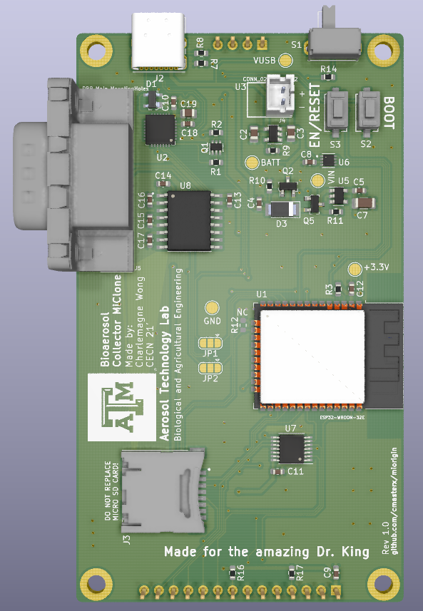

# MiOrigin
This device is a controller for a bioaerosol collector used by the [Aerosol Technology Lab](https://aerosoltechnologylab.tamu.edu/) of the Biological and Agricultural Engineering Department at Texas A&M University. The MiOrigin controller mimics the MiClone software, which requires a PC connection to use.
 
 ### Features
 - ESP32-WROOM-32E (16MB) MCU
 - 3.5" 480x320 touch-enabled LCD
 - Rechargeable 1000mAh LiPo battery via USB-C connector
 - Built-in male RS-232 port (MAX3232 RS-232 Line Driver) 
 - Over-the-air (OTA) update via BLE

## Branches

## USB Drivers for Windows, Linux, macOS
Install CP210x driver if device cannot be detected by computer if connecting to the controller via USB

- Download [CP210x Drivers](https://www.silabs.com/developers/usb-to-uart-bridge-vcp-drivers)
